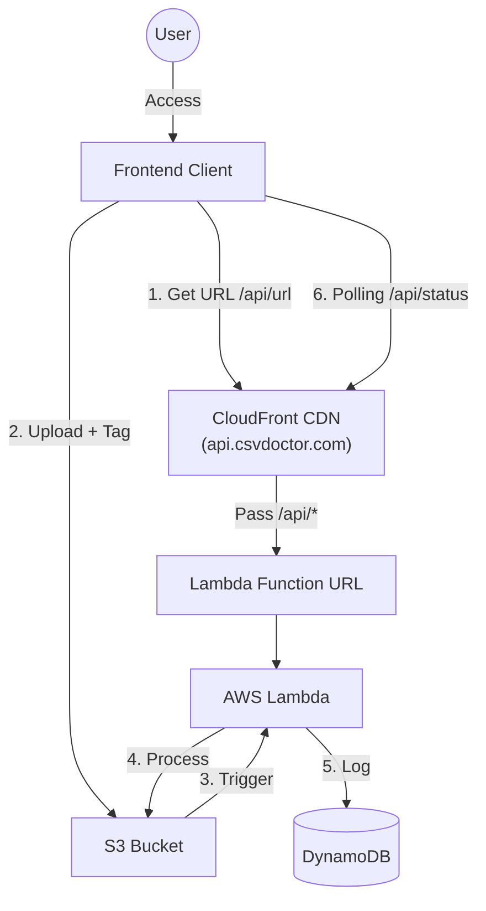

# 🩺 프로젝트 기획서: CSV Doctor (씨닥)

## 1. 프로젝트 개요 (Overview)

- **프로젝트명**: CSV Doctor (씨닥)
- **슬로건**: "엑셀에서 깨지는 한글, 1초 만에 진단하고 치료해 드립니다."
- **목표**: 복잡한 인코딩 지식 없이도, 누구나 자신의 CSV 파일이 어떤 환경에서 깨질 위험이 있는지 확인하고, 원하는 환경에 맞춰 완벽하게 변환하도록 돕는다.
- **타겟 유저**:
    - **마케터/기획자**: 솔루션에서 다운받은 데이터를 엑셀로 열었는데 '뛟쀍'이 나와 당황한 비개발 직군.
    - **글로벌 셀러**: 아마존/쇼피 등에 상품 대량 등록(CSV)을 해야 하는데 형식이 안 맞아 고생하는 셀러.
    - **학생/연구원**: 설문 데이터나 공공 데이터를 엑셀과 분석 툴(R, Python) 사이에서 오가며 쓰는 사람.

## 2. 문제 정의 및 해결 (Problem & Solution)

### ⚠️ 문제 상황 (Pain Point)
- **"엑셀에서만 깨져요"**: 최신 웹/맥(Mac) 환경은 UTF-8을 표준으로 쓰지만, 윈도우 엑셀은 **BOM(Byte Order Mark)**이 없는 CSV를 CP949로 오해하여 한글을 깨뜨립니다.
- **"저장은 어떻게 해요?"**: 메모장에서 '다른 이름으로 저장'하여 인코딩을 바꾸는 방법은 일반 사용자에게 너무 어렵고 번거롭습니다.

### 💡 우리의 해결책 (Solution)
- **자동 진단 (Diagnosis)**: 파일을 올리자마자 "이 파일은 윈도우 엑셀에서 깨집니다!"라고 알려줍니다.
- **원클릭 처방 (One-Click Fix)**: 사용자는 "엑셀용", "웹용" 버튼만 누르면 됩니다. 복잡한 기술 용어(BOM, EUC-KR)를 숨깁니다.

## 3. 핵심 기능 (Key Features)

### 3.1. 🩺 스마트 인코딩 진단 (Backend)
- **기능**: 파일 헤더의 BOM 유무와 샘플 텍스트 인코딩을 분석.
- **진단 로직**:
    - `UTF-8 (No BOM)` → ⚠️ **경고**: "윈도우 엑셀에서 깨질 수 있습니다."
    - `CP949 / EUC-KR` → ⚠️ **경고**: "맥이나 웹사이트 업로드 시 깨질 수 있습니다."
    - `UTF-8-SIG (With BOM)` → ✅ **안전**: "호환성이 완벽합니다."

### 3.2. 💊 맞춤형 변환 (Conversion)
- **윈도우 엑셀 최적화**
    - `UTF-8-SIG` (BOM 포함) 형식으로 변환. (가장 강력한 호환성)
- **웹/DB 표준화**
    - `Standard UTF-8` (BOM 제거) 형식으로 변환.

### 3.3. 🌐 글로벌 지원 (i18n)
- **기능**: 한국어(KO) 및 영어(EN) 인터페이스 완벽 지원.
- **구현**: Alpine.js의 상태 관리를 이용해 새로고침 없이 즉시 언어 전환.

### 3.4. 🛡️ 파일명 안전 처리 (Safe Filename Handling)
- **문제**: 파일명에 괄호(), 공백, 특수문자가 포함될 경우 S3 이벤트 트리거 시 URL Encoding 문제(%28...%29)로 파일 인식 실패.
- **해결책 (UUID Rename Strategy)**:
    - **저장**: S3 업로드 시 파일명을 무조건 **UUID(난수)**로 변경하여 저장 (예: `uploads/550e8400-e29b....csv`).
    - **메타데이터**: 원본 파일명(`매출자료(1).csv`)은 S3 객체의 Metadata(`x-amz-meta-originalname`)에 별도 저장.
    - **복원**: 다운로드 시 `Content-Disposition` 헤더를 조작하여 사용자는 원본 이름으로 다운로드.

### 3.5. 🛡️ 대기 시간 UX (Long Polling)
- **기능**: 대용량 파일이나 Cold Start로 인해 작업이 길어질 경우, 사용자에게 진행 상황을 시각적으로 안내.
- **구현**:
    - **Lottie Animation**: "치료 중입니다..." 애니메이션 노출.
    - **Polling**: 프론트엔드에서 2초 간격으로 변환 완료 여부 체크 (S3 결과 파일 확인).

## 4. 기술 스택 (Tech Stack) - Serverless Edition ⚡

### Backend (Compute & Logic)
- **Core**: FastAPI (Python 3.12+)
- **Adapter**: Mangum (FastAPI를 Lambda 이벤트로 변환).
- **Server**: AWS Lambda (요청 시에만 실행되는 서버리스 컴퓨팅).
    - **Always Free**: 가입 기간(12개월)과 무관하게 월 100만 건 요청 및 40만 GB-초 연산 시간 무료 제공.
- **Entry Point**: Lambda Function URLs.
    - **특징**: API Gateway 대체. 복잡한 설정 없이 HTTPS 엔드포인트 제공.
    - **비용**: $0 (완전 무료).
- **Domain & Routing**: AWS CloudFront.
    - **역할**: `api.csvdoctor.com` 같은 커스텀 도메인 연결 및 SSL 처리.
    - **라우팅**: `/api/*` 경로를 Lambda Function URL로 전달. (FastAPI가 내부 라우팅 처리)
    - **비용**: 월 1TB 전송 무료 (Free Tier).

### Database (Logs & Analytics)
- **DB**: AWS DynamoDB (NoSQL).
    - **Free Tier**: 25GB 스토리지 + 월 2억 건 요청 무료.
    - **용도**: 변환 요청 성공/실패 로그 기록.
    - **안정성**: 데이터 저장 시 3개의 가용 영역(AZ)에 자동 복제.

### Storage (File Handling)
- **Storage**: AWS S3.
    - **Cost**: 12 Months Free (가입 후 1년간 5GB 무료).
    - **1년 후**: 저장 용량 1GB당 약 30원 ($0.025).
    - **비용 절감 전략**: Lifecycle Rule 설정으로 업로드된 파일은 24시간 후 자동 삭제. (저장 비용 최소화)
- **Strategy**: Presigned URL 방식 (직접 업로드).

### Frontend (UI)
- **Framework**: Alpine.js + Tailwind CSS.
- **Hosting**: AWS S3 + CloudFront (AWS 통합 관리 시) 또는 Vercel (간편 배포 시).

### Infrastructure Management (IaC) - 확정 🛠️
- **Tool**: Terraform
- **선택 이유**:
    - **확장성**: 추후 AWS 외 다른 클라우드(Azure, GCP)나 온프레미스로 확장 시에도 동일한 문법 사용 가능.
    - **표준 기술**: 데브옵스(DevOps) 업계 표준 기술로서 커리어에 유리.
    - **통합 관리**: 프론트엔드(S3/CloudFront)와 백엔드(Lambda/DynamoDB)를 `main.tf` 하나로 통합 관리.

## 5. 배포 및 운영 전략 (Deployment Strategy)

### 🏛️ 시스템 아키텍처 (System Architecture)

### Phase 1: 아키텍처 (Tag-based Logic Dispatch)
S3 폴더 구조는 `uploads/` 하나로 단순하게 유지하고, **파일에 붙은 태그(Tag)**를 람다가 읽어서 로직을 분기합니다. CloudFront를 통해 커스텀 도메인(`api.csvdoctor.com`)을 연결하여 단일 진입점을 제공합니다.

1. **Upload (Client → S3)**:
    - 프론트엔드가 Presigned URL로 업로드할 때, **태그(Action=fix-encoding)**를 함께 부착합니다.
    - 참고: S3 태그 부착을 위해 `x-amz-tagging` 헤더를 사용합니다.

2. **Trigger (S3 → Lambda)**:
    - S3는 단순히 `uploads/` 폴더에 파일이 생기면 무조건 Lambda를 깨웁니다. (단순 트리거)

3. **Dispatch (Lambda Logic)**:
    - 깨어난 Lambda는 S3에게 **"이 파일 태그 뭐야?"(get_object_tagging)**라고 물어봅니다.
    - 태그 값(Action)을 확인하여 로직을 분기합니다.
        - `Action=fix-encoding`: 인코딩 변환 로직 실행.
        - `Action=to-json`: (미래 기능) JSON 변환 로직 실행.

4. **Process & Result**:
    - 변환된 파일을 `results/task-id.csv` 경로에 저장합니다.

5. **Check (Polling)**:
    - 프론트엔드는 `results/` 폴더를 주기적으로 확인하여 다운로드 링크를 획득합니다.

### Phase 2: 트래픽 폭증 시
- **구성**: Lambda의 Concurrency(동시성) 제한 상향 조정.
- **비용 관리**: 요청 횟수가 수백만 건을 넘어가면 Lambda 비용이 EC2보다 비싸질 수 있음. 이때 EC2/Fargate로 마이그레이션 고려.

## 6. 수익화 모델 (Monetization)

### 6.1. 광고 (AdSense)
- **진단 결과 페이지**: "경고 메시지" 바로 하단에 320x100 배너 배치 (주목도 최상).
- **로딩 화면**: 파일 변환 대기 시간(프로그레스 바) 동안 300x250 전면 광고 노출.

### 6.2. 기부 (Donation)
- **플랫폼**: Buy Me a Coffee 또는 토스 아이디(Toss ID).
    - 국내 사용자는 토스 송금이 훨씬 간편하여 전환율이 높음.
- **전략**:
    - 변환 완료 페이지 하단에 "도움이 되셨나요? 서버비 보태기 ☕" 문구와 함께 버튼 노출.
    - 너무 강요하지 않는 '위트 있는' 문구 사용 전략.

## 7. 개발 로드맵 (Roadmap)

### Step 1: 핵심 엔진 개발 (Local)
- FastAPI + Mangum 설정.
- `csv_fixer.py` (인코딩 변환 로직) 구현.
- DynamoDB Local 설정: `docker-compose`로 로컬 DB 및 `dynamodb-admin` GUI 구축.

### Step 2: 인프라 코드 작성 (Terraform) 🏗️
- `main.tf` 작성:
    - `resource "aws_s3_bucket"`: 업로드/결과 버킷 생성 + Lifecycle Rule(2시간 후 삭제) 추가.
    - `resource "aws_s3_bucket_notification"`: 단순 트리거 설정 (`uploads/` 경로 전체 감시).
    - `resource "aws_lambda_function_url"`: API Gateway 대신 Function URL 생성.
    - `resource "aws_cloudfront_distribution"`: 커스텀 도메인(`api.csvdoctor.com`) 연결 및 Lambda URL 오리진 설정.
    - `resource "aws_lambda_function"`: FastAPI 배포.
- **IAM Role**: Lambda가 S3의 태그를 읽을 수 있도록 `s3:GetObjectTagging` 권한 추가.
- **Terraform State 관리**: 로컬 파일 또는 S3 백엔드 설정.

### Step 3: UI 구현 (Frontend)
- Alpine.js로 Presigned URL 요청 (CloudFront 도메인 호출).
- **Upload Logic**: 업로드 시 `x-amz-tagging` 헤더에 `Action=fix-encoding` 태그 포함 전송.
- **Polling Logic**: `setInterval`을 활용하여 변환 완료 감지 및 다운로드 처리.

### Step 4: 출시 및 마케팅
- **배포 실행**: `terraform init` -> `terraform apply` 한 방으로 전체 인프라 생성 및 배포.
- 커뮤니티 홍보.

## 8. 운영 및 모니터링 (Admin)

### 8.1. 구조화된 로그 (Structured Log)
- **저장소**: AWS DynamoDB (`csv-doctor-logs`)
- **필드**: `task_id`, `status`, `action`, `file_size`, `process_time`, `client_ip(hashed)`, `error_msg`
- **목적**: 성공률 분석 및 에러 원인 파악.

### 8.2. 관리자 대시보드 (Streamlit)
- **도구**: Python 기반의 Streamlit.
- **기능**:
    - 일간 방문자 수 및 성공률 그래프.
    - 최근 에러 로그 테이블 조회.
- **배포**: 로컬 실행 또는 Streamlit Cloud(무료) 활용.

## 9. 품질 관리 및 자동화 (Testing & CI/CD)

### 9.1. Backend Testing (Pytest)
- **도구**: `pytest`, `moto` (AWS 모킹), `memory_profiler`.
- **전략 (Functional)**:
    - 로컬에서 `moto`를 이용해 가짜 S3/DynamoDB를 띄우고 Lambda 핸들러 로직 검증.
    - CP949 -> UTF-8 정상 변환 여부 및 바이너리 깨짐 예외 처리 검증.
- **전략 (Resource Limits & Performance)**:
    - **메모리 프로파일링**: `memory_profiler` 데코레이터를 사용하여 50MB CSV 처리 시 메모리 사용량이 Lambda 할당량(예: 128MB/512MB)을 초과하지 않는지 측정.
    - **타임아웃 시뮬레이션**: 대용량 파일 변환 로직이 Lambda 최대 실행 시간(예: 기본 3초, 최대 15분) 내에 완료되는지 벤치마킹.

### 9.2. Frontend Testing (E2E with Python)
- **도구**: Playwright (Python).
    - 백엔드와 동일한 언어(Python)로 프론트엔드 테스트 스크립트 작성 가능.
- **전략 (E2E)**:
    - GitHub Actions에서 로컬 웹 서버(`python -m http.server`) 실행.
    - Playwright가 브라우저를 띄워 `index.html` 접속.
    - 파일 업로드 시뮬레이션 -> "치료 중" 화면 전환 확인 -> "완료" 버튼 노출 확인.

### 9.3. 통합 자동 배포 (GitHub Actions)
- 백엔드와 프론트엔드를 하나의 파이프라인에서 관리하거나, 경로에 따라 분리하여 실행합니다.
- **Trigger**: `main` 브랜치 push.
- **Job 1: Backend (Terraform)**
    - pytest 통과 시 -> Terraform apply 실행 (Lambda 코드 갱신).
- **Job 2: Frontend (S3 Sync)**
    - Playwright 테스트 통과 시 -> AWS CLI 실행.
    - `aws s3 sync ./static s3://my-frontend-bucket` (파일 업로드).
    - `aws cloudfront create-invalidation` (캐시 삭제로 즉시 반영).

## 10. 마케팅 및 수익화 준비 (Marketing & Monetization Prep)

### 10.1. 사이트에 광고 붙이기 (AdSense 승인 전략)
- 구글 애드센스는 '콘텐츠 부족'으로 거절될 확률이 높으므로, 도구 페이지 외에 최소한의 보강 작업이 필수적입니다.
- **필수 준비물**:
    - **개인정보처리방침 (Privacy Policy)**: 애드센스 필수 요건. 무료 생성기를 활용해 하단 푸터에 링크 추가.
    - **도메인 (Custom Domain)**: `vercel.app` 같은 기본 주소보다는 `.com`이나 `.kr` 도메인 구매 권장 (신뢰도 상승).
    - **ads.txt 설정**: 루트 경로(`domain.com/ads.txt`)에 구글 인증 파일 업로드.
- **콘텐츠 보강 팁**:
    - 단순 변환기만 두지 말고, "왜 엑셀에서 한글이 깨지나요?", "UTF-8과 CP949의 차이" 같은 설명 글(블로그 포스트)을 3~5개 정도 하단이나 별도 페이지에 추가하면 승인 확률이 비약적으로 상승함.

### 10.2. 사이트 홍보하기 (Growth Hacking)
- **SEO (검색 엔진 최적화)**:
    - **Meta Tags**: `og:title`, `og:description` 설정하여 카톡/슬랙 공유 시 썸네일 예쁘게 나오게 하기.
    - **Sitemap & Robots.txt**: 구글 서치 콘솔(GSC) 및 네이버 웹마스터 도구 등록.
    - **키워드 공략**: `h1` 태그에 "엑셀 한글 깨짐 해결", "CSV 인코딩 변환" 등 타겟 키워드 포함.
- **성과 분석**:
    - **Google Analytics 4 (GA4)**: 방문자 수 및 '변환 버튼 클릭률(Conversion Rate)' 추적.